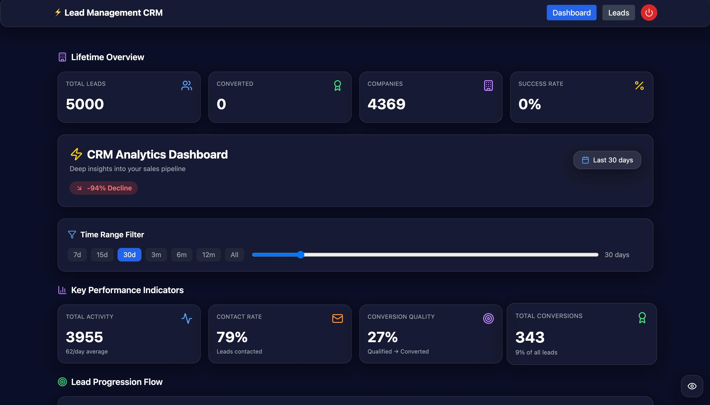
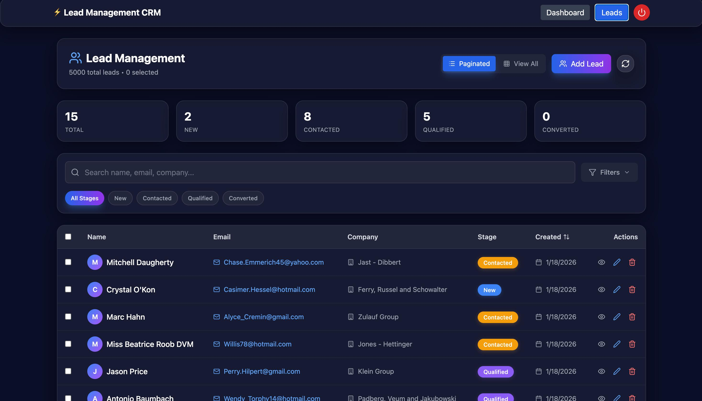
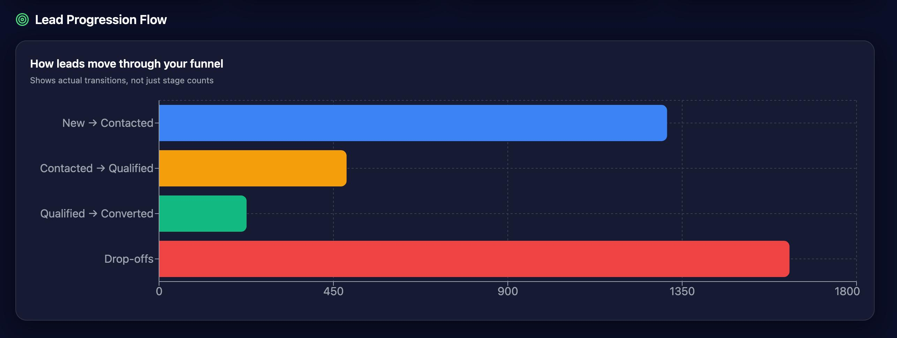
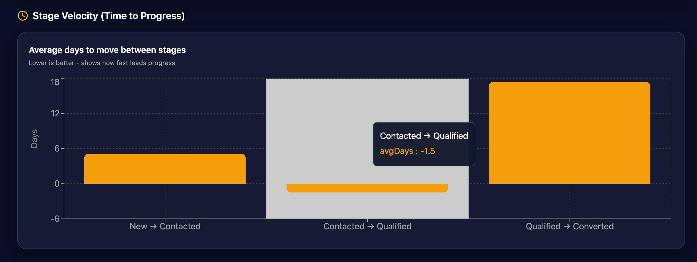

# 📊 Lead Management Dashboard

A full-stack **CRM & Analytics Dashboard** built with **React, Node.js, MongoDB**, and **Recharts**, designed to manage leads and visualize pipeline performance with **deep time-based analytics**.

This project includes:

* Secure authentication
* Full CRUD lead management
* Advanced filtering & bulk actions
* A high-signal analytics dashboard with funnel, velocity, and conversion insights

---

## 🚀 Features

### 🔐 Authentication

* JWT-based authentication
* Protected API routes via middleware
* Dashboard access restricted to authenticated users

---

### 🧑‍💼 Lead Management

* Create, update, delete leads
* Inline stage editing
* Bulk actions (update stage, delete, export CSV)
* Pagination or “View All” mode
* Advanced filters:

  * Search (name, email, company)
  * Stage filter
  * Date range filter
  * Company filter
* Expandable lead detail rows
* CSV export (selected or all)

---

### 📈 Analytics Dashboard (Core Highlight)

**Two data layers are used intentionally:**

* **Lifetime Analytics**

  * Total leads
  * Total conversions
  * Unique companies
  * Overall success rate

* **Time-Filtered Analytics (Slider-controlled)**

  * Activity volume
  * Stage distribution
  * Conversion rate
  * Funnel flow
  * Stage velocity
  * Conversion momentum

#### Dashboard Visualizations

* Lead progression flow (actual transitions, not just counts)
* Stage velocity (time between stages)
* Stage distribution over time (stacked area)
* Daily vs cumulative conversions (composed chart)
* Trend analysis (growth / decline / stable)
* Performance KPIs (contact rate, conversion quality, avg daily leads)

---

## 🗂️ Project Structure

```
├── backend
│   ├── controllers
│   │   ├── analyticsController.js
│   │   ├── authController.js
│   │   └── leadController.js
│   ├── middleware
│   │   └── auth.js
│   ├── models
│   │   ├── Lead.js
│   │   ├── LeadHistory.js
│   │   └── User.js
│   ├── routes
│   │   ├── analytics.js
│   │   ├── auth.js
│   │   └── leads.js
│   ├── seed.js
│   └── server.js
│
├── frontend
│   ├── src
│   │   ├── pages
│   │   │   ├── Dashboard.jsx
│   │   │   └── Leads.jsx
│   │   ├── components
│   │   │   ├── LeadFormModal.jsx
│   │   │   └── LeadFilter.jsx
│   │   ├── services
│   │   │   └── api.js
│   │   ├── App.jsx
│   │   └── main.jsx
│   └── vite.config.js
│
├── debug.sh
└── README.md
```

---

## ⚙️ Tech Stack

### Frontend

* React (Vite)
* Tailwind CSS
* Recharts
* Lucide Icons
* Axios

### Backend

* Node.js
* Express
* MongoDB + Mongoose
* JWT Authentication

---

## 🛠️ Setup Instructions

### 1️⃣ Clone the Repository

```bash
git clone https://github.com/CodeBunny09/LeadManagementDashboard.git
cd LeadManagementDashboard
```

---

### 2️⃣ Backend Setup

```bash
cd backend
npm install
```

Create a `.env` file in `/backend`:

```env
PORT=5000
MONGO_URI=your_mongodb_connection_string
JWT_SECRET=your_secret_key
```

(Optional) Seed sample data:

```bash
node seed.js
```

Start backend:

```bash
npm start
```

Backend runs on:

```
http://localhost:5000
```

---

### 3️⃣ Frontend Setup

```bash
cd frontend
npm install
npm run dev
```

Frontend runs on:

```
http://localhost:5173
```

---

## 🔌 API Endpoints (Overview)

### Auth

* `POST /api/auth/login`
* `POST /api/auth/register`

### Leads

* `GET /api/leads`
* `POST /api/leads`
* `PUT /api/leads/:id`
* `DELETE /api/leads/:id`

### Analytics

* `GET /api/analytics` → lifetime metrics
* `GET /api/analytics/history` → stage history events

> ⚠️ All analytics routes require a valid Authorization header.

---

## 🧪 Debugging

A `debug.sh` script is included to inspect API responses and validate data shapes.

```bash
chmod +x debug.sh
./debug.sh
```

Frontend also includes:

* Toggleable debug panel in Dashboard
* Live inspection of filtered counts and stage distributions

---

## 🖼️ Screenshots

##### Dashboard Overview


##### Lead Management


##### Analytics Flow


##### Stage Velocity


---

## 🧠 Design Philosophy

* **Analytics ≠ Raw Counts**
* Focus on **lead movement**, **velocity**, and **drop-offs**
* Clear separation between **lifetime data** and **time-filtered insights**
* Visual storytelling over vanity metrics

---

## 📌 Future Enhancements

* Role-based access (Admin / Sales)
* Export analytics as PDF
* Per-user performance metrics
* WebSocket real-time updates
* Custom dashboard layouts

---

## 🙌 Author

**CodeBunny09**
Built as a practical, production-grade CRM analytics system.